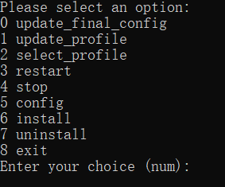

# Clash Auto

## 支持的平台

-   Windows
-   Linux

## 依赖

1.  安装 python, python-pip
2.  pip install ruamel.yaml requests

## 安装

1.  从 release 下载软件包 (免安装)。
2.  双击运行 `clashauto.bat`。
3.  选择 `install` 后, Windows 会安装一个开机启动的 clash 服务。

## 使用

### 软件的文件的作用

-   clashauto.bat: 用于管理 clash 服务。
-   config.ini: Clash Auto 的配置。
-   config: 是 clash 的配置目录。
-   profiles: 用于放置 profile 文件。
-   basic_clash_config.yaml: 用于配置 clash 的基础配置。修改该文件后, 记得重启 clashauto.bat
-   final_clash_config.yaml: 通过 basic_clash_config 和 profile 文件合并后配置文件, clash 是用这个配置文件启动的。
-   tpl: 用于根据 Clash 模板配置文件生成新的配置文件。
    -   tpl_clash_config.yaml: Clash 模板配置文件
    -   proxy_provider_urls: 放置有 proxies 字段的 Clash 配置。
    -   tpl_out_clash_config.yaml: 生成的配置文件

### clashauto.bat 的选项

双击运行 `clashauto.bat` 后, 会有如下选项:

-   update_final_config: 表示更新 final_clash_config.yaml 这个文件依赖的资源。
-   update_profile

    表示更新 profile 文件依赖的资源。

    可以用一个后缀是 `_url` 的文件放置 profile 的链接。它会将链接的内容保存到将 `_url` 为 `.yaml` 的文件。同时会更新该 profile 依赖的资源。
    
    如果链接的内容不是一个 clash 配置文件, 可以通过一些订阅转换网站转换成 clash 的配置。比如: https://acl4ssr-sub.github.io/
    
    比如:

    profiles/example_url
    
    ```
    <your clash config url>
    ```
    
    同时也支持 `vmess://, trojan://` 等开头的链接并且可以将它们一起放在一个 url 文件。比如:
    
    profiles/example_url

    ```
    <your clash config url>
    vmess://...
    trojan://...
    ```
    
    选择该选项后会将 url 的内容保存到 profiles/example.yaml, 且更新该配置依赖的资源。更新成功后, 用户在 select_profile 选项中选择该配置即可。
    
-   select_profile: 表示选择一个 `profile` 和 `basic_clash_config.yaml` 合并到 `final_clash_config.yaml`。同时重启 clash 服务使配置文件生效。
-   restart/stop/config/install/uninstall clash_service: 都是用于操作 clash 服务。
-   test_config: 测试 `final_clash_config.yaml` 配置文件。
-   create_yaml: 用于根据 Clash 模板配置文件生成新的配置文件。
-   uwp_loopback: 允许应用程序在本地回环地址（loopback address）上进行网络通信。为了增强应用程序的安全性，Microsoft 在默认情况下禁用了微软商店的应用在本地回环地址上进行网络通信的功能。

*Clash Auto 会使用自身作为代理来更新 clash 配置文件的依赖和更新 clash 的配置文件。*

### Clash 的客户端

浏览器访问 http://127.0.0.1:9090/ui 即可。

### Clash Auto 的配置

sc_host: 表示订阅转换的后端地址。在转换 url 时, 如果发现 url 的内容不是 Clash 配置, 则使用订阅转换来转换该 url。

### 根据模板配置生成新的配置

目的: 如何有多个有 proxies 字段的配置合并在一个配置文件中使用时, 一般会为每个配置文件写一个 proxy-provider, Select Group 和 Auto Group。该功能是为每个配置每个文件的生成这些组。

比如:

tpl_clash_config.yaml

```yaml
proxy-groups:
  - name: "LastMatch"
    type: select
    proxies:
      - DIRECT
      - Entry

  - name: "Entry"
    type: select
    proxies:
      - AllAuto
      - AllSelect
      # Group0Select, Group1Select, ...
      - <select_groups>
    url: 'http://www.gstatic.com/generate_204'
    interval: 300

  - name: "AllSelect"
    type: select
    use:
      # provider0, provider1, ...
      - <providers>
    url: 'http://www.gstatic.com/generate_204'
    interval: 300

  - name: "AllAuto"
    type: url-test
    proxies:
      # Group0Auto, Group1Auto, ...
      - <auto_groups>
    url: 'http://www.gstatic.com/generate_204'
    interval: 30

  # Select Group Template
  - name: "GroupSelect"
    type: select
    use: null
    url: 'http://www.gstatic.com/generate_204'
    interval: 300

  # Auto Group Template
  - name: "GroupAuto"
    type: url-test
    use: null
    url: 'http://www.gstatic.com/generate_204'
    interval: 300

proxy-providers:
  # provider template
  provider:
    type: http
    url: null
    path: null
    interval: 3600
    health-check:
      enable: true
      interval: 600
      url: http://www.gstatic.com/generate_204
```

proxy_provider_urls (如果这些 url 的内容如果没有 proxies 的内容, 会使用 SubConverter 来转换。)

```yaml
https://example1.com
https://example2.com
```

tpl_out_clash_config.yaml

```yaml
- name: LastMatch
  type: select
  proxies:
  - DIRECT
  - Entry
- name: Entry
  type: select
  proxies:
  - AllAuto
  - AllSelect
  - Group0Select
  - Group1Select
  url: http://www.gstatic.com/generate_204
  interval: 300
- name: AllSelect
  type: select
  use:
  - provider0
  - provider1
  url: http://www.gstatic.com/generate_204
  interval: 300
- name: AllAuto
  type: url-test
  proxies:
  - Group0Auto
  - Group1Auto
  url: http://www.gstatic.com/generate_204
  interval: 30
- name: Group0Select
  type: select
  use:
  - provider0
  url: http://www.gstatic.com/generate_204
  interval: 300
- name: Group0Auto
  type: url-test
  use:
  - provider0
  url: http://www.gstatic.com/generate_204
  interval: 300
- name: Group1Select
  type: select
  use:
  - provider1
  url: http://www.gstatic.com/generate_204
  interval: 300
- name: Group1Auto
  type: url-test
  use:
  - provider1
  url: http://www.gstatic.com/generate_204
  interval: 300
proxy-providers:
  provider0:
    type: http
    url: https://example1.com       # 或者是用 SubConverter 转换后的 url
    path: proxy-providers/tpl/provider0.yaml
    interval: 3600
    health-check:
      enable: true
      interval: 600
      url: http://www.gstatic.com/generate_204
  provider1:
    type: http
    url: https://example2.com
    path: proxy-providers/tpl/provider1.yaml
    interval: 3600
    health-check:
      enable: true
      interval: 600
      url: http://www.gstatic.com/generate_204
```

会将合并后的文件复制到 profiles 目录, 然后更新并选择这个 profile 即可。

### 启用/关闭 Tun 模式

配置 `basic_clash_config.yaml` 的 dns 和 tun 字段, 重启 Clash Auto 再 select_profile 即可。可查找相关文档进行配置。

启用 Tun 模式: 

```yaml
dns:
  enable: true
  listen: 0.0.0.0:53
  ipv6: false
  default-nameserver:
    - 119.29.29.29
    #- 223.5.5.5
    #- 180.76.76.76
    - 114.114.114.114
    #- 8.8.8.8
  enhanced-mode: fake-ip
  nameserver:
    - 119.29.29.29
    #- 223.5.5.5
    #- 180.76.76.76
    - 114.114.114.114
    #- 8.8.8.8
    - tls://dns.rubyfish.cn:853 # DNS over TLS
    - https://1.1.1.1/dns-query # DNS over HTTPS
    - dhcp://en0 # dns from dhcp
  fallback:
      - https://8888.google/dns-query
      - https://1.0.0.1/dns-query
      - https://dns.twnic.tw/dns-query
      - https://doh.opendns.com/dns-query
      - https://dns-nyc.aaflalo.me/dns-query
      - https://dns.aa.net.uk/dns-query
      - https://sg.adhole.org/dns-query
      - https://kaitain.restena.lu/dns-query
      - https://hydra.plan9-ns1.com/dns-query
      - https://jp.tiar.app/dns-query
      - https://doh.asia.dnswarden.com/adblock
  fallback-filter:
    geoip: true
    geoip-code: CN
    ipcidr:
      - 0.0.0.0/8
      - 10.0.0.0/8
      - 100.64.0.0/10
      - 127.0.0.0/8
      - 169.254.0.0/16
      - 172.16.0.0/12
      - 192.0.0.0/24
      - 192.0.2.0/24
      - 192.88.99.0/24
      - 192.168.0.0/16
      - 198.18.0.0/15
      - 198.51.100.0/24
      - 203.0.113.0/24
      - 224.0.0.0/4
      - 240.0.0.0/4
      - 255.255.255.255/32
    domain:
      - '+.google.com'
      - '+.facebook.com'
      - '+.youtube.com'
      - "+.github.com"
      - "+.githubusercontent.com"
      - "+.googlevideo.com"

tun:
  enable: true
  stack: system # or gvisor
  dns-hijack:
    - any:53
    - tcp://any:53
  auto-route: true
  auto-detect-interface: true # conflict with interface-name
```

关闭 Tun: 修改这些字段即可。

```yaml
dns:
  enable: disable
tun:
  enable: disable
```

## Q&A

Q: 如果 clash 客户端可以连上服务端, 但是无法翻墙?

A: 设置 Windows 防火墙, 使 clash.exe 允许通过防火墙。

## Linux

### 依赖

和 Windows 平台一样。

### 安装

比如:

1.  安装 Clash。并确保有 clash server unit (`systemctl cat clash` 可以查看)。
    -   比如: `yay -S clash-premium-bin`
    -   或者 [Clash Tun](https://github.com/Kr328/clash-premium-installer)
2.  将 clash-auto 软件包解压到 `/opt/clash-auto`, 或者其他地方。
3.  [optional] 将 clashauto 放入 PATH。

    ```sh
    chmod a+x /opt/clash-auto/clashauto
    ln -sf /opt/clash-auto/clashauto /usr/bin/clashauto。
    ```

4.  运行 `clashauto`, 选择 config_clash_server。

    ```
    [Service]
    # 删除原先的 ExecStart
    ExecStart=
    # 修改 `-d, -f` 参数。这里我是使用 Clash Tun, 所以前面有 bypass-proxy。
    ExecStart=/usr/bin/bypass-proxy /usr/bin/clash -d /opt/clash-auto/config -f /opt/clash-auto/final_clash_config.yaml
    ```

5.  修改 `/opt/clash-auto/config` 的文件属性

    ```sh
    cd /opt/clash-auto
    sudo chown root:<your user name> config
    sudo chmod g+w config
    ```

### 使用

和 Windows 平台差不多。

## Screenshots

