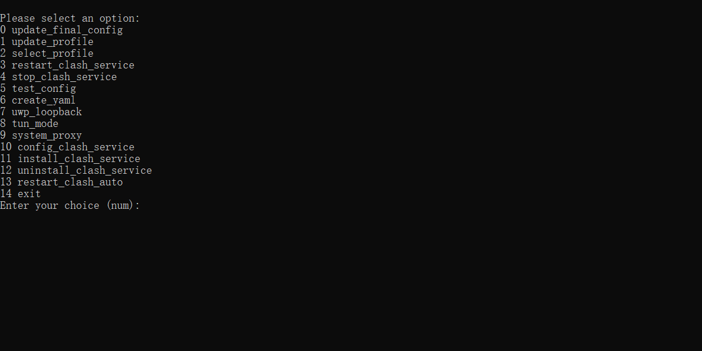

# Clash Auto

## Supported Platforms

- Windows

## Dependencies

1. Install Python
2. Run `pip install ruamel.yaml requests` to install the required Python packages.

## Installation

1. Download the release package (no installation required) from the release page.
2. Double-click `clashauto.bat` to run the program.
3. Select `install` to install a startup clash service for Windows.

## Usage

### The Purpose of Each File in the Software

- `clashauto.bat`: Used to manage the clash service.
- `config`: The configuration directory for clash.
- `profiles`: Used to store profile files.
- `basic_clash_config.yaml`: Used to configure basic clash settings. Remember to restart `clashauto.bat` after making changes to this file.
- `final_clash_config.yaml`: The configuration file used to start clash after merging the `basic_clash_config` and profile files.

### Options in `clashauto.bat`

After double-clicking `clashauto.bat`, you will see the following options:

- `update_final_config`: Update the resources required by `final_clash_config.yaml`.
- `update_profile_config`:

    Update the resources required by profile files. 
    
    You can place a file with the suffix `_url` containing a link to a profile. It will save the content of the link to a file with `_url` replaced by `.yaml` and update the resources required by that profile. If the content of the URL is not a Clash configuration file, it can be converted into a Clash configuration file through some subscription conversion websites, such as https://acl4ssr-sub.github.io/.

- `select_profile`: Select a profile and merge it with `basic_clash_config.yaml` to generate `final_clash_config.yaml`. Then restart the clash service to make the new configuration take effect.
- `restart/stop/config/install/uninstall`: Used to manage the clash service.

*Clash Auto uses its own proxy to update the dependencies of the clash configuration file and update the clash configuration file itself.*

### Clash Client

Access http://127.0.0.1:9090/ui in your browser to use the client.

## Q&A

Q: What should I do if the clash client can connect to the server, but cannot access blocked content?

A: You may need to configure Windows Firewall to allow clash.exe to access the internet.

## Screenshots

